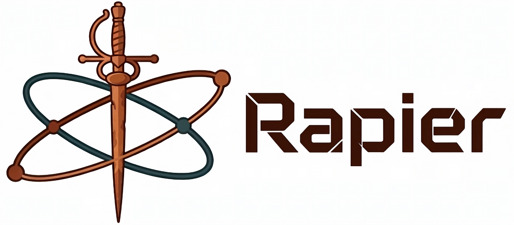

<p align="center">
  
</p>
<p align="center">
    <a href="https://discord.gg/vt9DJSW">
        
    </a>
    <a href="https://github.com/dimforge/rapier/actions">
        
    </a>
    <a href="https://crates.io/crates/rapier2d">
         
    </a>
    <a href="https://crates.io/crates/rapier3d">
         
    </a>
    <a href="https://opensource.org/licenses/Apache-2.0">
        
    </a>
</p>
<p align = "center">
    <strong>
        <a href="https://rapier.rs">Website</a> | <a href="https://rapier.rs/docs/">Documentation</a>
    </strong>
</p>

-----

<p align = "center">
<b>2D and 3D physics engines</b>
<i>for the Rust programming language.</i>
</p>

-----

## What is Rapier?

Rapier is a set of 2D and 3D physics engines for games, animation, and robotics. These crates
are `rapier2d`, `rapier3d`, `rapier2d-f64`, and `rapier3d-f64`. They are written with the Rust
programming language, by the [Dimforge](https://dimforge.com) organization. It is forever free
and open-source!

## Getting started

The easiest way to get started with Rapier is to:

1. Read the [user-guides](https://www.rapier.rs/docs/).
2. Play with the examples: `cargo run --release --bin all_examples2` and `cargo run --release --bin all_examples3`.
   The examples of every language and integration are listed [below](#examples).
3. Don't hesitate to ask for help on [Discord](https://discord.gg/vt9DJSW), or by opening an issue on GitHub.

## Examples

| Variant | Examples | User-guide snippets |
| --- | --- | --- |
| Rust | [`examples2d/`](examples2d/), [`examples3d/`](examples3d/), [`examples3d-f64/`](examples3d-f64/) | [2D](website/docs-examples/2d/rust/examples/), [3D](website/docs-examples/3d/rust/examples/) |
| C | [`bindings/c/examples/`](bindings/c/examples/), testbed scenes in [`bindings/c/testbed/examples2d/`](bindings/c/testbed/examples2d/) and [`bindings/c/testbed/examples3d/`](bindings/c/testbed/examples3d/) | [2D](website/docs-examples/2d/c/examples/), [3D](website/docs-examples/3d/c/examples/) |
| JavaScript | testbed demos in [`bindings/typescript/testbed2d/src/demos/`](bindings/typescript/testbed2d/src/demos/) and [`bindings/typescript/testbed3d/src/demos/`](bindings/typescript/testbed3d/src/demos/) | [2D](website/docs-examples/2d/javascript/src/snippets/), [3D](website/docs-examples/3d/javascript/src/snippets/) |
| Python | [`bindings/python/examples/`](bindings/python/examples/), testbed scenes in [`bindings/python/rapier-testbed/rapier_testbed/examples3/`](bindings/python/rapier-testbed/rapier_testbed/examples3/) | [3D](website/docs-examples/3d/python/) |
| Bevy plugin | [`bindings/bevy_rapier/bevy_rapier2d/examples/`](bindings/bevy_rapier/bevy_rapier2d/examples/) and [`bindings/bevy_rapier/bevy_rapier3d/examples/`](bindings/bevy_rapier/bevy_rapier3d/examples/) | [2D](website/docs-examples/2d/bevy/examples/), [3D](website/docs-examples/3d/bevy/examples/) |

The user-guide snippets are the code shown in the [user guide](https://rapier.rs/docs/): they are compiled (and, for
C and Python, run) to make sure the guide stays up to date. The bindings and the Bevy plugin live in the
[`bindings/`](bindings/) directory.

## Performance

SIMD-batched constraint solving and contact processing are always on: the
solver processes 4 contact manifolds per instruction, falling back to scalar
code on targets without SIMD support. For performance-sensitive applications,
also enable:

- **`parallel`** — multithreading of the whole physics step (broad phase,
  narrow phase, solver) through rayon. On CPUs with heterogeneous cores
  (Apple silicon, Intel hybrid), also call
  `PhysicsPipeline::set_dedicated_thread_pool(None)` to run the step on a
  pool sized to the performance cores only: the solver's barrier-paced stages
  otherwise run at the speed of the slowest (efficiency) core.

```toml
rapier3d = { version = "*", features = ["parallel"] }
```

## C and C++ bindings

See [`bindings/c/README.md`](bindings/c/README.md) for the C ABI, C++ ownership helpers, native build instructions,
and Unity/Unreal integration guidance. The bindings cover 2D/3D and f32/f64, including soft bodies.

## Python bindings

The Python bindings ship as a single package, `rapier3d`, wrapping the 3D engine with 32-bit floats (there
are no 2D or f64 Python bindings yet). See [`bindings/python/README.md`](bindings/python/README.md) for how to build the bindings,
the docs, and the testbed from a checkout, [`bindings/python/docs/`](bindings/python/docs/) for the API documentation, and the
[user guide](https://rapier.rs/docs/) for its Python version.

## AI coding disclaimer and policy

AI coding is extensively used for the implementation and maintenance of the following crates: `mjcf-rs`,
`rapier3d-mjcf`, as well as the Python bindings (`bindings/python/rapier-py*`), including their tests, examples, and docs.

We actively use AI assistance (with human reviews) for the following tasks:
- Documentation generation.
- Changelogs generation.
- Tests generation.
- CI configuration and scripts.

We accept contributions involving AI coding as long as:
- They are verified to work properly by a human.
- The code quality is up to human-written code standards.
- Include non-regression tests whenever applicable (which itself can be AI-generated).

## Resources and discussions

- [Dimforge](https://dimforge.com): See all the open-source projects we are working on! Follow our announcements
  on our [blog](https://www.dimforge.com/blog).
- [User guide](https://www.rapier.rs/docs/): Learn to use Rapier in your project by reading the official User Guides.
- [Discord](https://discord.gg/vt9DJSW): Come chat with us, get help, suggest features, on Discord!
- [NPM packages](https://www.npmjs.com/search?q=%40dimforge): Check out our NPM packages for Rapier, if you need to
  use it with JavaScript/Typescript.

Please make sure to familiarize yourself with our [Code of Conduct](CODE_OF_CONDUCT.md)
and our [Contribution Guidelines](CONTRIBUTING.md) before contributing or participating in
discussions with the community.
